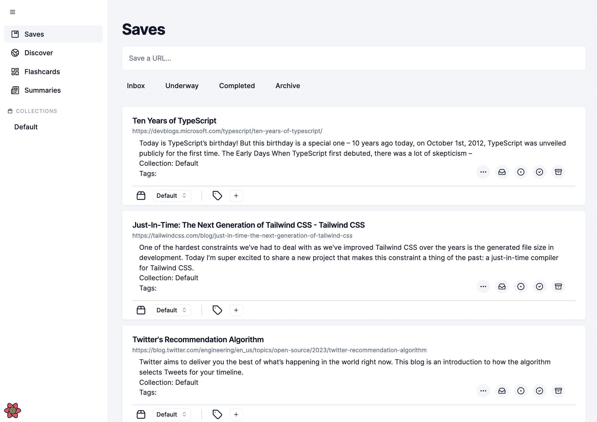

# capstone-project-3900w16bendermen
capstone-project-3900w16bendermen created by GitHub Classroom

## Prisma & Database

To set up prisma:

```bash
$ npx prisma generate
$ npx prisma migrate dev -- 3900DB # last argument "3900DB" is name of your local postgresql database
```

The prisma migrate command will automatically run the seed in `prisma/seed.ts` to initialise the database with some initial data. Feel free to modify the seed data. The command is specified in `package.json`:

```json
// package.json
{
    // ...
    "prisma": {
        "seed": "ts-node --compiler-options {\"module\":\"CommonJS\"} src/server/db/seed.ts"
    },
    //...
}
```

To seed manually:

```bash
npx prisma db seed
```

To reset the database to initial state using the seed data.

```bash
$ npx prisma migrate reset
```

The seed contains a user as such:

```json
{
    "id": "483242390", // randomly generated uuidv4
    "firstName": "Ender",
    "lastName": "Man",
    "email": "admin@endermen.com",
    "password": "123456"
}
```

You can login in using this seeded user's email and password. You will see some pre-made items in the inbox.

