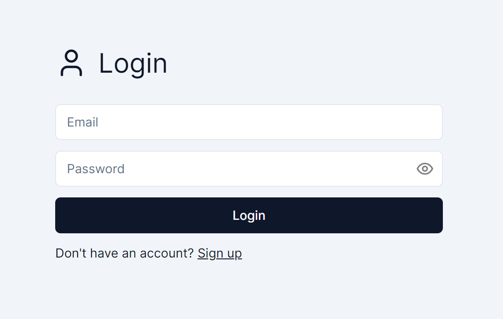
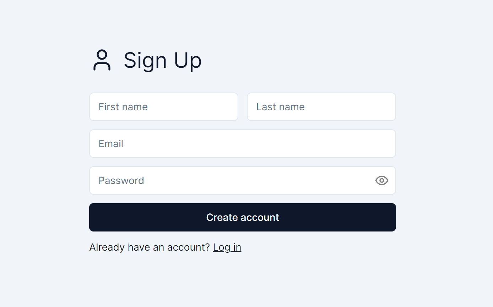
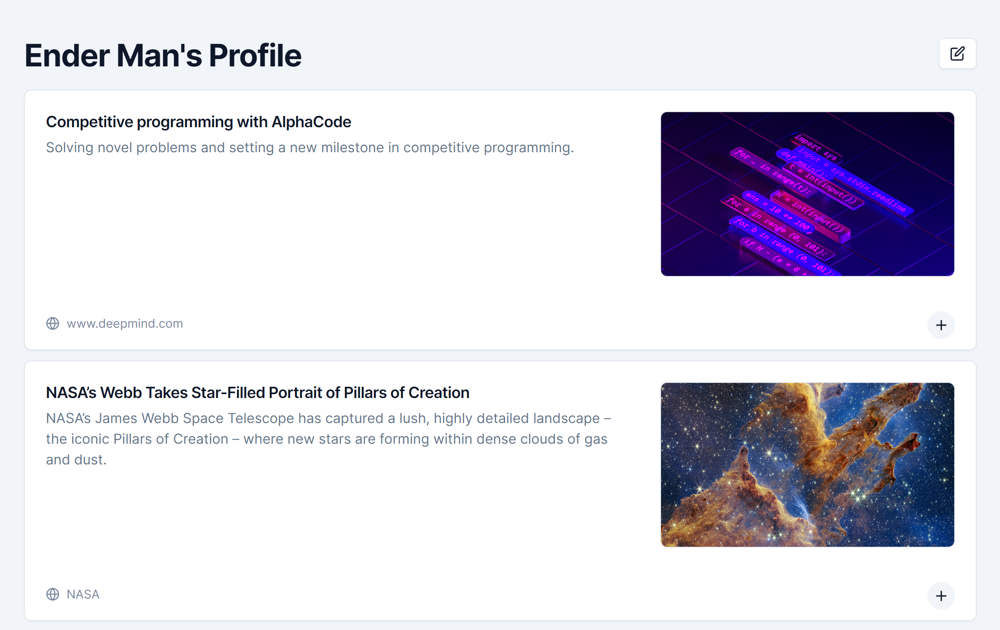
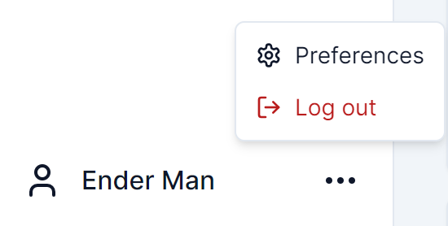
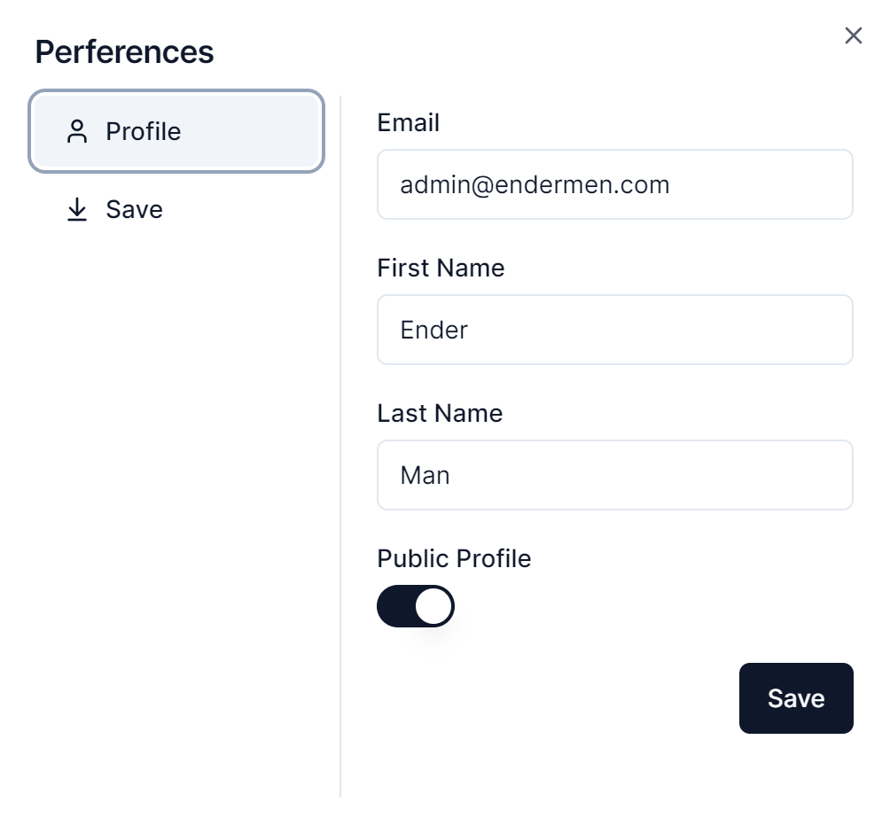

# Accounts and Authentication

## Guide

- [Accounts and Authentication](#accounts-and-authentication)
  - [Guide](#guide)
  - [Introduction](#introduction)
  - [Logging In](#logging-in)
  - [Signing Up](#signing-up)
  - [Profile](#profile)
  - [Profile Options](#profile-options)

## Introduction

Authentication is central to all functionality in Memcache, as one must be registered and logged in as a user in order to use the app. Saves, collections, tags, summaries, and flashcards are all associated with a specific user.

Each user has an email, password, first name, and last name. The former two are used for authentication, while the latter two are used for identifying users in the app.

## Logging In

When first starting the app, users will be greeted with this page, where they may log in to the app.

Page: `/app/login`

## Signing Up

Those without an account may sign up on this page.

Page: `/app/signup`

## Profile

This page is accessible by clicking the profile tab at the bottom of the sidebar. Here, a user is shown a list of their publicly saved items.

Page: `/app/profile/[id]`

## Profile Options

A user may also change their preferences or log out by clicking the profile options button next to the profile tab:

This is the dialog box for setting user preferences:

