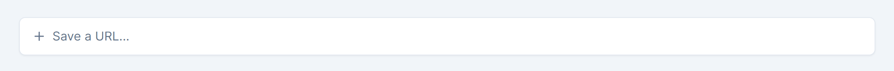
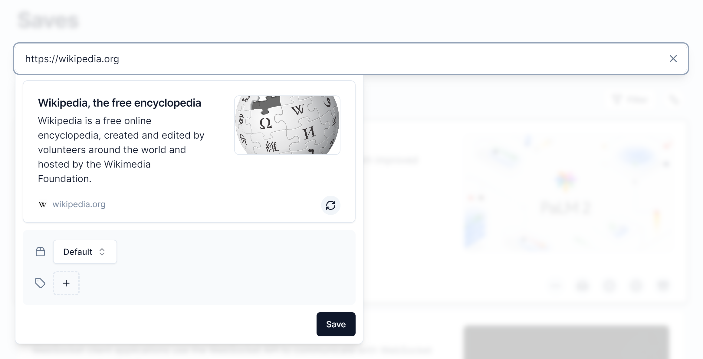

# Content Saver

## Guide

-   [Introduction](#introduction)
-   [URL Input Tab](#url-input-tab)
-   [Content Saver UI](#content-saver-ui)

## Introduction

The content saver allows the user to add new saves, and is located at the top of the content home. It operates by taking a URL and scraping the page at the URL for data. The data is then used to create a save, which functions as a bookmark, and will appear on the content home.

By default, new saves will be placed under the 'Default' collection with an 'Inbox' status and without any tags.

## URL Input Tab

This is where the URL is typed in as input.

## Content Saver UI

This is what the content saver's UI looks like when a valid URL has been typed in; it will show a preview of how the save will appear. A user can also select which collection the save should belong to and which tags it should contain upon being saved.

