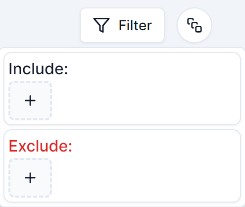

# Tags and Collections

## Guide

-   [Introduction](#introduction)
-   [Tag Filtering](#tag-filtering)
-   [Collection Pages](#collection-pages)

## Introduction

Tags and collections are used for organising items, and are user-created. Each item can have as many tags as a user wants (it has none by default), but can only belong to one collection ('Default' by default).

Tags are added to or removed from an item through the item panel. An item can be moved to a collection through the item panel as well as through multi-select.

## Tag Filtering

Items may be filtered by tags on the content home. This is done by using the tag filter:

## Collection Pages

Each collection has its own page located at `/app/collections/[id]`, which features a content home identical to the one at `/app/saves` except that only items belonging to the collection in question are displayed. Collection pages can be accessed by selecting a collection's name either on the sidebar or on an item card.
