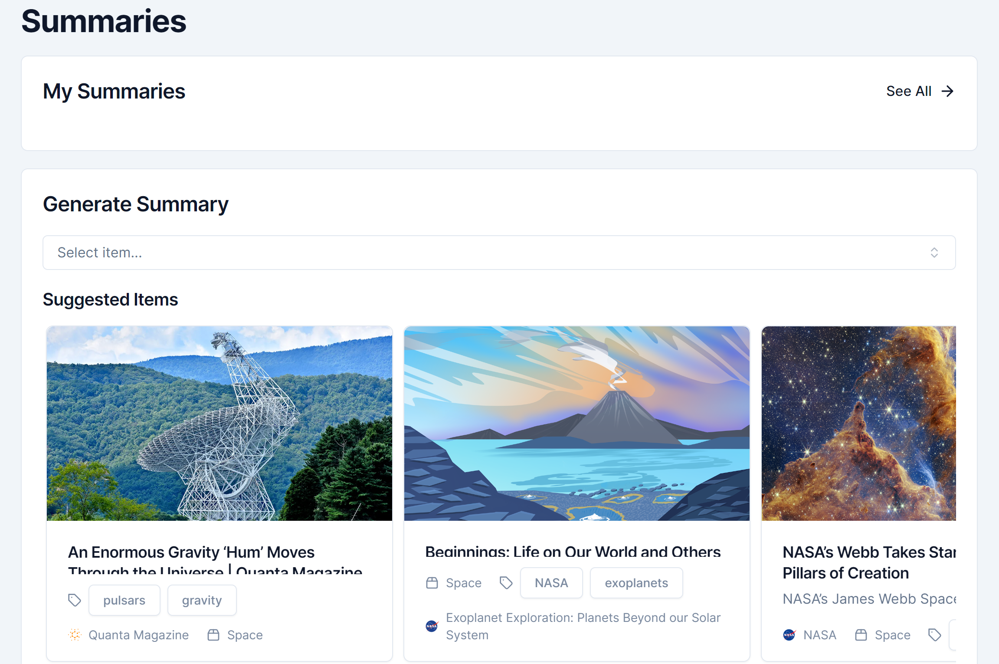
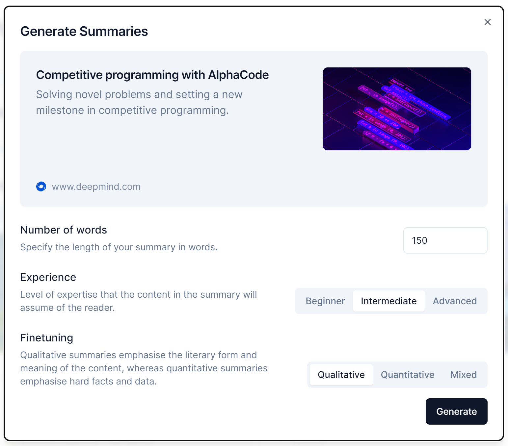

# Content Summariser

## Guide

-   [Introduction](#introduction)
-   [Page](#page)
-   [Summary Generator](#summary-generator)

## Introduction

The content summariser takes a saved item and generates a text-based summary of the content at the item's URL, using ChatGPT.

It is accessible by clicking the 'Summaries' tab on the sidebar, or navigating to `/app/summaries`.

## Page

The content summariser's page contains a list of summaries that the user has created, as well as a summary generator card that allows the user to select an item from which a summary can be created:

## Summary Generator

The summary generator provides a few options for customising how the summary is generated:

