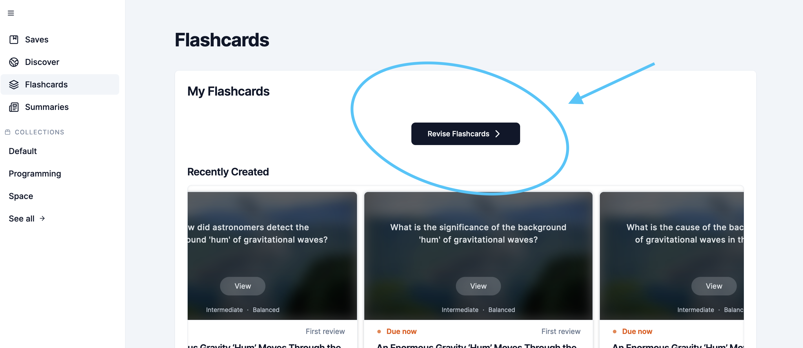
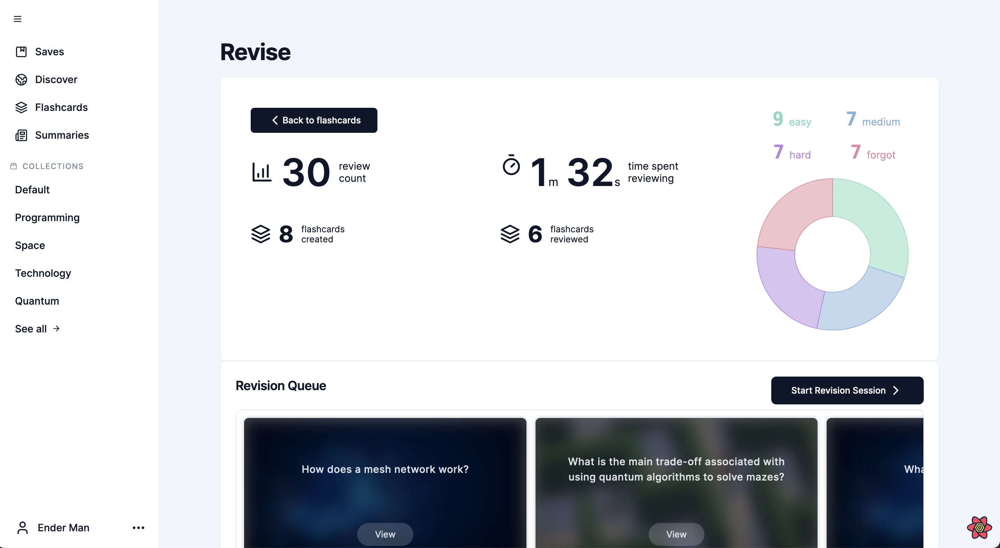
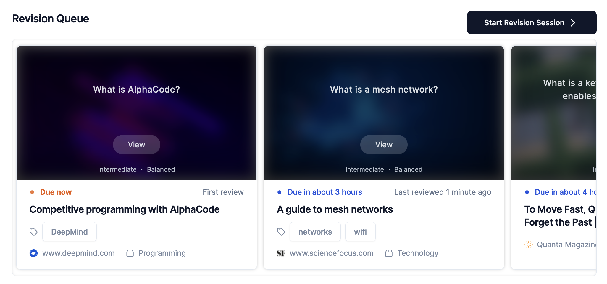
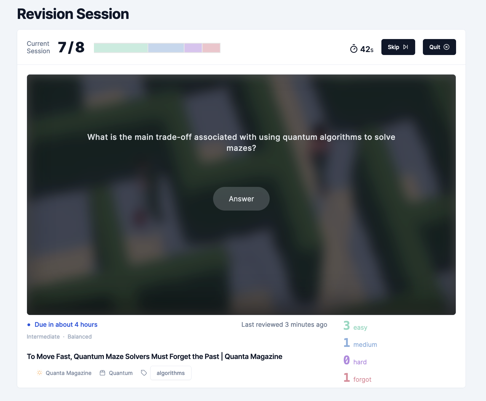
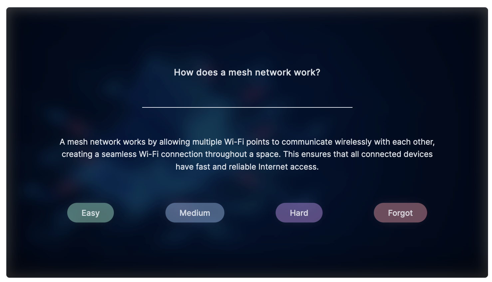
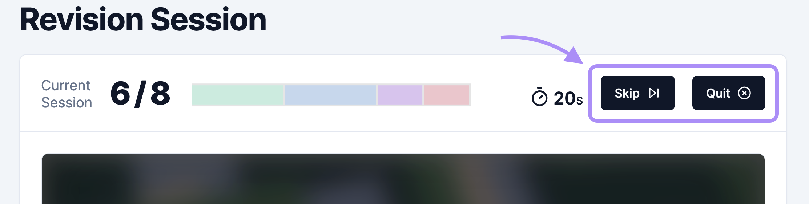
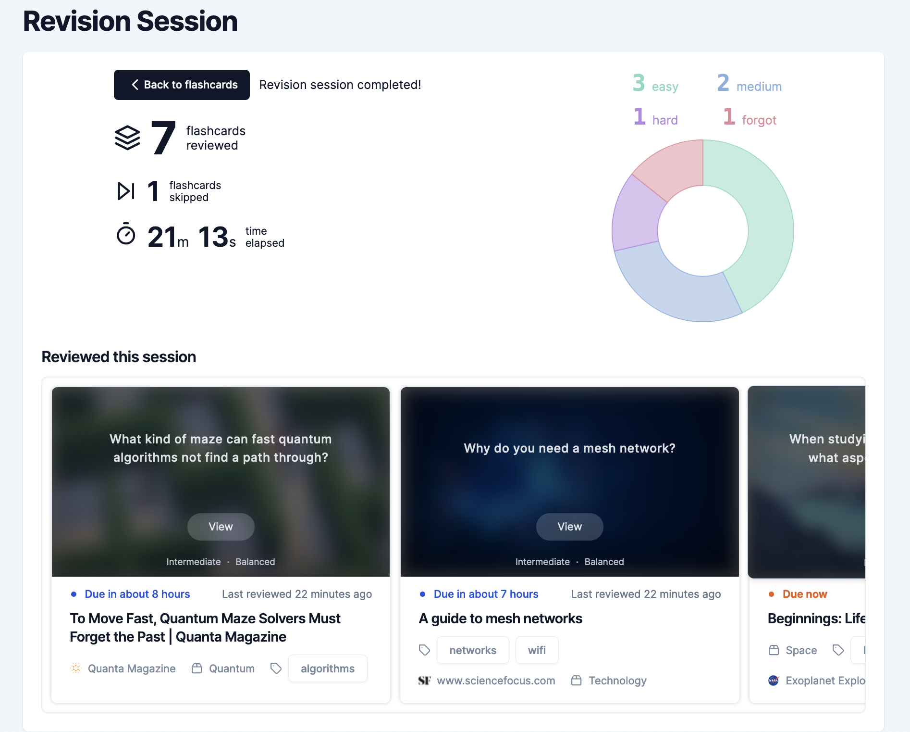

# Spaced Repetition Review

## Guide

- [Spaced Repetition Review](#spaced-repetition-review)
  - [Guide](#guide)
  - [Introduction](#introduction)
  - [Revision Queue](#revision-queue)
  - [Revision Session](#revision-session)

## Introduction

The Spaced Repetition Review feature allows the use to revise flashcards through an interactive medium to test learn the content of their saved items overtime and track their progress.

Click on the "revise flashcards" button from the flashcards page to go to the revision page:

## Revision Queue

The "Revise" page shows statistics about your revision sessions, including:

- how many reviews you have completed,
- how many time you have spent reviewing flashcards,
- how many flashcards you have created,
- how many of your flashcards you have reviewed at least once.

Below, there is also a "Revision Queue" which shows flashcards that are due for review at the start, and flashcards that will be due in the future towards the end.

## Revision Session

Click "Start Revision Session" to start revising your flashcards.

During a revision session, you will be able to see information such as:

- how many flashcards you have reviewed so far,
- the proportion of ratings (Easy, Medium, Hard, Forgot),
- the time elapsed during this revision session.

To review a flashcard, you simply read the question and try to recall the answer. Once you are done, click "Answer" to reveal the answer.

You can then rate the review with one of these four options depending on how accurately and easily you recalled the answer:

- Easy: Correct answer with perfect recall
- Medium: Correct answer, after some hesitation
- Hard: Correct answer, but required significant effort to recall
- Forgot: Incorrect or no answer

The app uses a spaced repetition algorithm called SM-2 to calculate the optimal time interval to schedule the next review of each flashcard, based a variety of information including:

- how easily you recalled the answer,
- how many times you have reviewed this flashcard in the past,
- your past performance on the flashcard.  

You also have the option to skip a flashcard, or quit the revision session early.

Once you have completed or ended your revision session, you will greeted by an end screen showing some statistics about the session, as well as the flashcards that were reviewed (not skipped) during this session and when they are next due for review:

You can then click "Back to flashcards" to go back to your revision queue.
