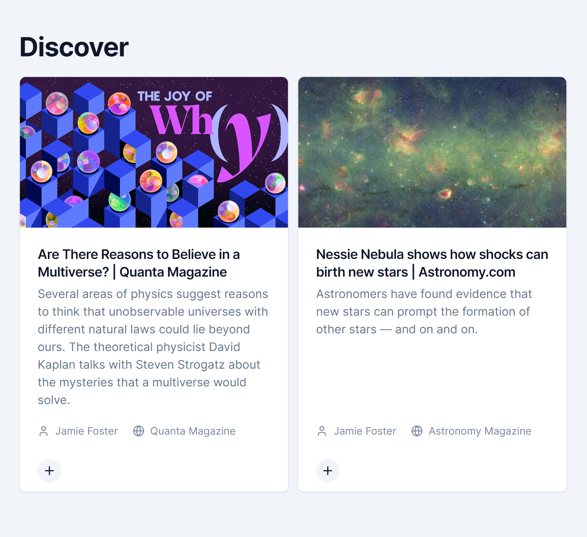

# Content Discovery

## Guide

-   [Introduction](#introduction)
-   [Page](#page)

## Introduction

Content discovery gives reading recommendations for users. It works by showing saved items from other users where the associated tags or collections are common to those held by the user in question.

The page for content discovery is accessible by clicking the 'Discover' tab on the sidebar, or navigating to `/app/discover`.

## Page

This is what the page looks like. In this case, the suggested items belong to another user's 'Space' collection. The items are recommended to this user as they also have a collection named 'Space'.

