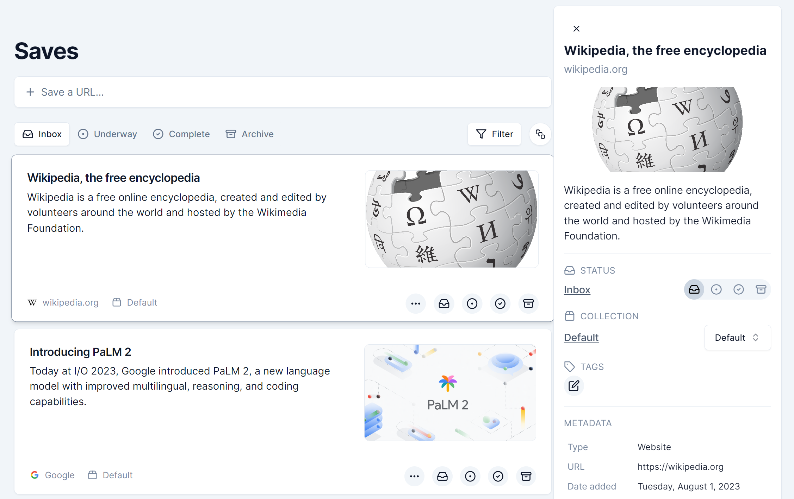
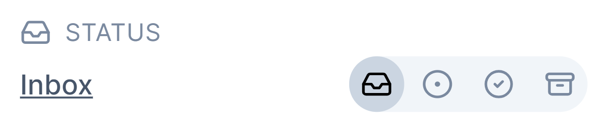
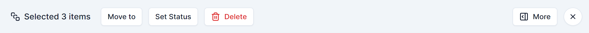
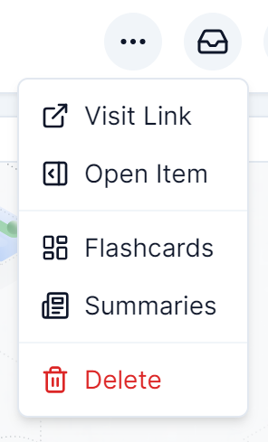

# Content Home

## Guide

-   [Introduction](#introduction)
-   [Content Home with Panel](#content-home-with-panel)
-   [Item Status](#item-status)

## Introduction

The content home is where all items (saves) are located. It is accessible by clicking the 'Saves' tab on the sidebar, or navigating to `/app/saves`.

## Content Home with Panel

This is what the content home's UI looks like.

It features the content saver, a status filter, a tag filter, a multi-select toggler, and a list of items.
Each card shows the title, description, URL, collection, tags, options, and status selector for its respective save.

It also features the item panel on the right, which provides more details and options for the selected save. The item panel can be closed by clicking the X button at the top-left, and re-opened by clicking on a save.

## Item Status

The content home is divided into four parts, each for a different status - 'Inbox', 'Underway', 'Complete', and 'Archive'. New items are given the 'Inbox' status.

An item can only have one status at a time, and the user can set the status of an item by clicking on the status selector for its save, which is located both on the save card and on the item panel. The purpose of giving a status to an item is to indicate its progress as a bookmark.

This is what the item panel status selector looks like.

## Multi-select and Item Operations

Multiple items may be selected simultaneously by activating multi-select, which can be toggled with the multi-select button:

When activated, the status filter is replaced with a set of options for operations to be performed on the selected items:

The 'Move to' button reveals a collection selector, while the 'More' button reveals the item panel.

Individual items also have their own set of options:

