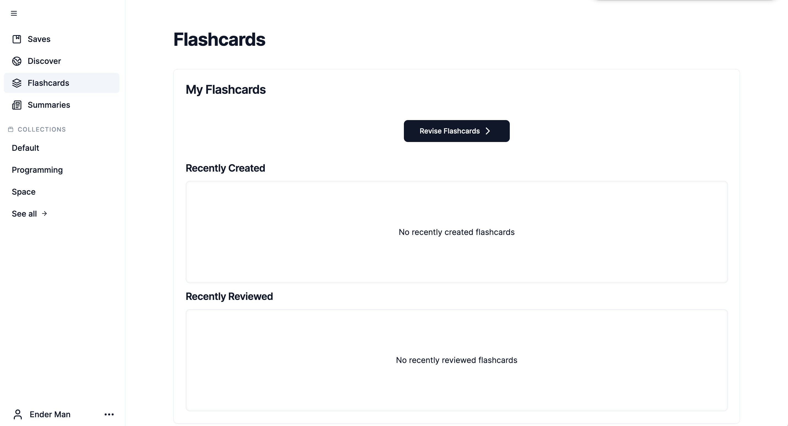
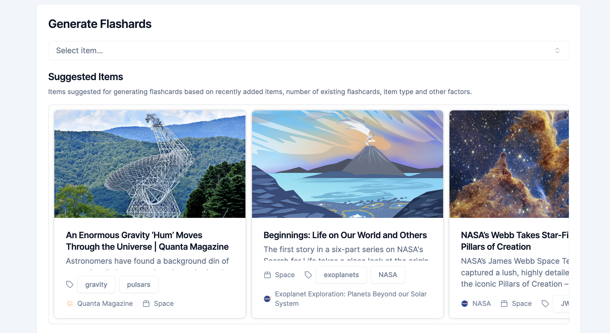
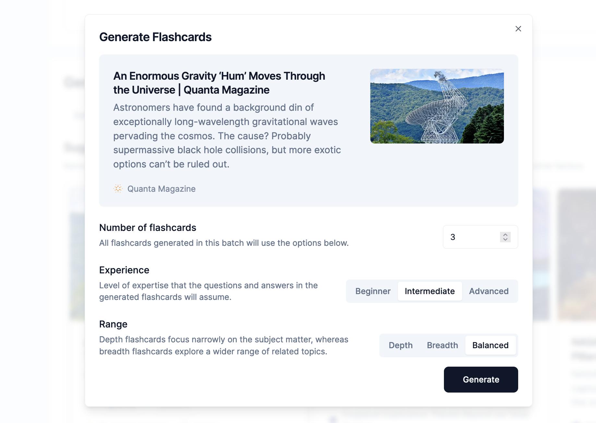
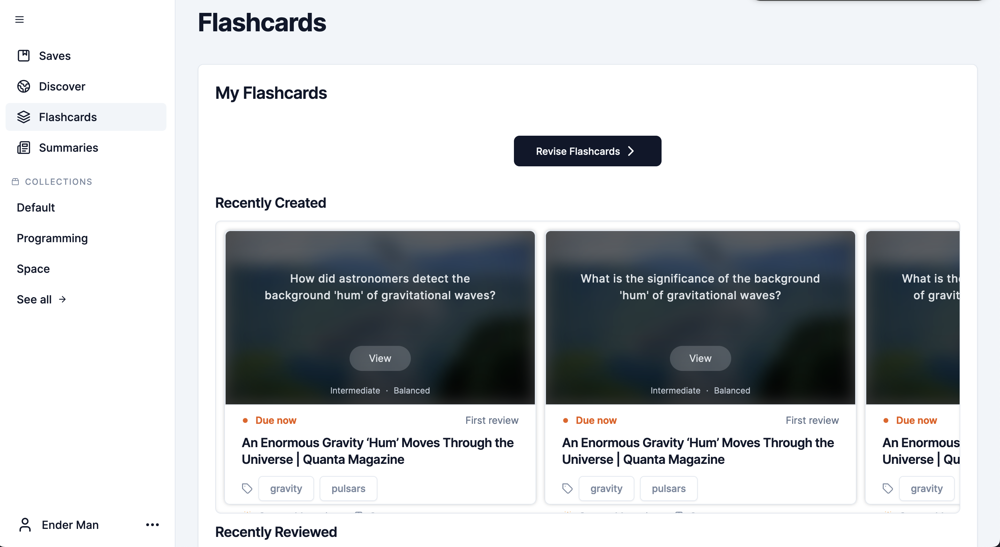
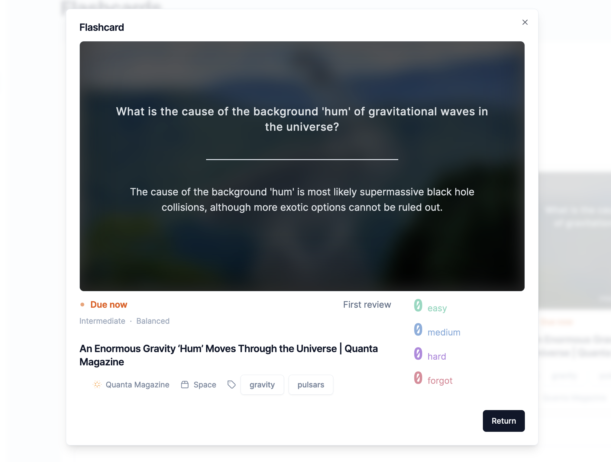

# Flashcard Generator

## Guide

- [Flashcard Generator](#flashcard-generator)
  - [Guide](#guide)
  - [Introduction](#introduction)
  - [Generate Flashcards](#generate-flashcards)
  - [Flashcards Overview](#flashcards-overview)

## Introduction

The Flashcard Generator is a tool for generating question-answer pairs to help the user to test their knowledge and understanding of any web content that they have saved, such as articles, essays, reports and other types of knowledge-heavy media.

This feature lives on the "Flashcards" page at [http://localhost:3000/app/flashcards](http://localhost:3000/app/flashcards).

## Generate Flashcards

Initially no flashcards are present. We can scroll down to the "Generate Flashcards" section to generate new flashcards.

The "Suggested Items" subsection recommends specific saved items that would be most suitable for the flashcard format of revision. This recommendation algorithm takes into account various factors, including:

- the date that the item was added (prefer more recent items)
- the number of flashcards each item already has (prefer items with fewer existing flashcards),
- the type of item (prefer articles over music or videos)

Clicking on one of these suggested items will open a dialog with customisable options for generating flashcards.

## Flashcards Overview

Flashcard generation takes about 4 seconds per flashcard, so once you click "Generate", please expect a short delay.

Once flashcards have been generated, you will see them show up in the "My Flashcards > Recently Created" subsection.

You can click "view" to see a preview of each flashcard, including the answer, experience level and other information.

