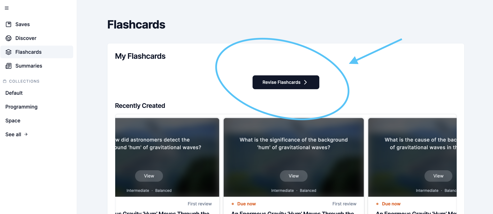
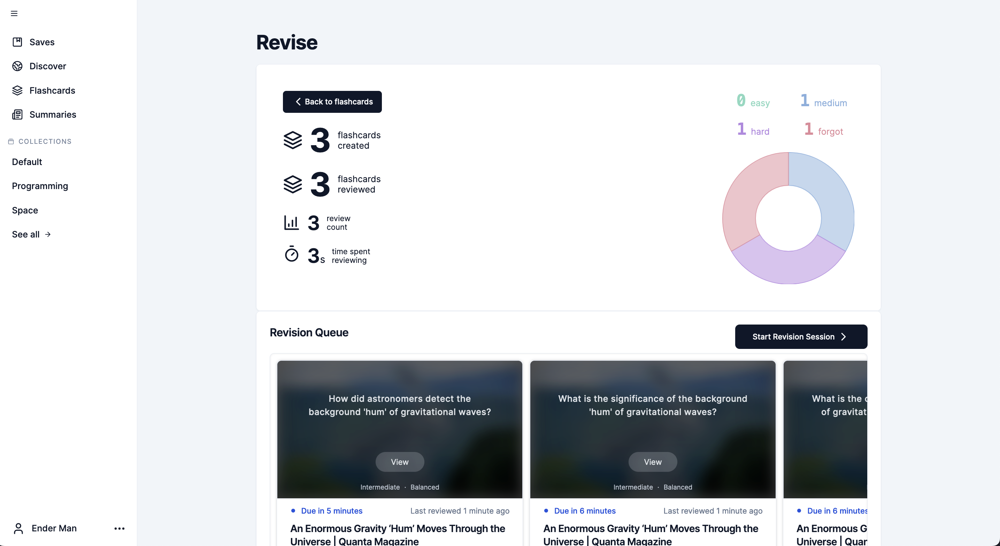

# Spaced Repetition Review

## Guide

- [Spaced Repetition Review](#spaced-repetition-review)
  - [Guide](#guide)
  - [Introduction](#introduction)

## Introduction

Spaced Repetition Review allows the use to revise flashcards through an interactive medium to test learn the content of their saved items overtime and track their progress.

Click on the "revise flashcards" button from the flashcards page to go to the revision page:

